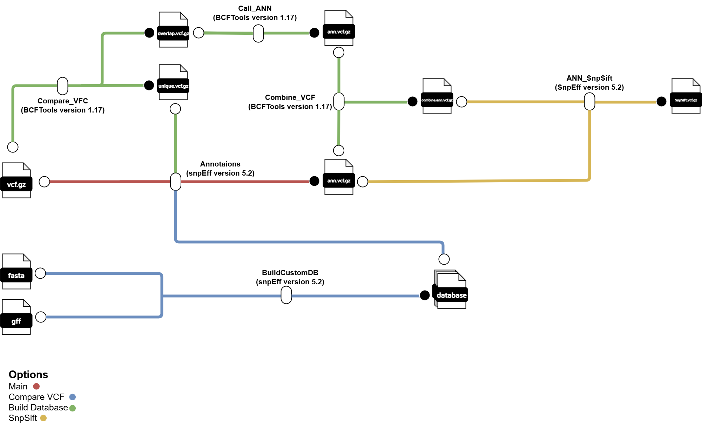

# Nextflow-Annotations


## หัวข้อ
1. [บทนำ](#1-บทนำ)
2. [การใช้งาน Nextflow-Annotations](#2-การใช้งาน-Nextflow-Annotations)
3. [การเตรียมเครื่องมือและข้อมูลสำหรับ Nextflow-Annotations](#3-การเตรียมเครื่องมือและข้อมูลสำหรับ-Nextflow-Annotations)
4. [รายละเอียดขั้นตอนใน Nextflow-Annotations](#4-รายละเอียดขั้นตอนใน-Nextflow-Annotations)
5. [การปรับแต่งการ Annotations ใน VEP](#5-การปรับแต่งการ-Annotations-ใน-VEP)
6. [Output](#6-Output)

---

## 1. บทนำ
 Nextflow-Annotations เป็น bioinformatics pipline ที่พัฒนาขึ้นสำหรับการทำ Variants Annotations โดยจะมีขั้นตอนดังต่อไปนี้ 
1. การทำ Variant Annotations
2. การสร้าง Database (BuildCustomDB)
3. การเปรียบเทียบข้อมูล Variant ที่ซ้ำกับข้อมูล Variant ที่มีอยู่ (Comapare_VCF)
4. การดึงข้อมูล Variant Annotations ที่ซ้ำกับข้อมูล Variant ที่มีอยู่ (Call_ANN)
5. การรวมไฟล์ (Combine_VCF)
6. การใช่ SnpSift (ANN_SnpSift)



## 2. การใช้งาน Nextflow-Annotations
### การใช้งานแบบไม่ใช้ขั้นตอน Comapare_VCF 
ผู้ใช้งานสามารถใช้คำสั่งต่อไปนี้ในการสั่งใช้งาน Nextflow-Annotations โดยข้อมูลที่อยู่ใน data จะต้องอยู่ในรูป vcf.gz และจะต้องระบุ `--species` ที่ต้องการ Annotations โดย workflow การทำงานจะเป็นไปตามเส้นแดง

```bash
nextflow run main.nf -profile gb --input <path-data>  --species <species-samples>  --output <path-results>
```
### การใช้งานแบบใช้ขั้นตอน Compare_VCF 
ผู้ใช้งานสามารถใช้ option `--vcf_compare` ในการระบุเส้นทางของไฟล์ VCF ที่จะใช้ในการเปรียบเทียบ โดย workflow การทำงานจะเป็นไปตามเส้นเขียว

```bash
nextflow run main.nf -profile gb --input <path-data> --vcf_compare <path>/{compare}.vcf.gz --species <species-samples>  --output <path-results>
```

### การใช้งานแบบใช้การสร้าง Database เอง 
ผู้ใช้งานสามารถใช้ `--mode custom` ในการสร้าง Databese ในการ Annotations เอง ด้วยไฟล์  `fasta ` และ  `gff ` โดย workflow การทำงานจะเป็นไปตามเส้นสีน้ำเงิน ซึ่งเหมาะสำหรับในกรณีที่ผู้ใช้ต้องการทำงานกับ species ที่ไม่มีอยู่ใน snpEff 

```bash
nextflow run main.nf -profile gb --input <path-data> --mode custom --species <species-samples> --fasta <path-fasta> --gff <path-gff> --output <path-results>
```

### การใช้งานแบบใช้ขั้นตอน ANN_SnpSift
ผู้ใช้งานสามารถใช้ option `--SnpSift` โดย workflow การทำงานจะเป็นไปตามเส้นส้ม

```bash
nextflow run main.nf -profile gb --input <path-data> --SnpSift on --species <species-samples>  --output <path-results>
```

### Options
- `--input` = โฟลเดอร์ input (จำเป็น:ค่าเริ่มต้น:data)
- `--output` = โฟล์เดอร์ output (จำเป็น:ค่าเริ่มต้น:output)
- `--mode`  = เลือกไฟล์ config ในการรัน Nextflow
- `--vcf_compare` = เส้นทางไฟล์ VCF ในการเปรียบเทียบในขั้นตอน Comapare_VCF (ไม่จำเป็น)
- `--fasta`  = เลือกไฟล์ config ในการรัน Nextflow
- `--gff`  = เลือกไฟล์ config ในการรัน Nextflow
-  `--species`  = เลือกไฟล์ config ในการรัน Nextflow
-  `--SnpSift`  = เลือกไฟล์ config ในการรัน Nextflow

## 3. การเตรียมเครื่องมือและข้อมูลสำหรับ nextflow-vep
### เครืองมือ 
1. Nextflow: version 19 
2. Variant Annotations: snpEff version 113
3. BuildCustomDB: snpEff version 113
4. Comapare_VCF: BCFTools version 1.17
5. Call_ANN: BCFtools version 1.17
6. Combine_VEP: BCFTools version 1.17
7. ANN_SnpSift: snpEff version 113 

### การเตรียม Config
ผู้ใช้งานสามารปรับแต่งเครื่องมือที่ใช้งานในไฟล์ gb.config ให้เหมาะสมกับทรัพยากรในเครื่อง โดย gb.config จะทำงานรวมกับ nextflow.config โดยจะใช้ตัวเลือก `-profile` เพื่อเลือก config ที่จะใช้งาน
```bash
process {
  executor = 'slurm'
  queue = 'memory'
  cache = 'lenient'


  withName: ANN_snpEff {
  module = 'snpEff/5.2c-GCCcore-12.2.0-Java-11:HTSlib/1.9-foss-2018b'
  cpus = 8
  memory = '16 GB'
  }

  withName: BuildCustomDB {
  module = 'snpEff/5.2c-GCCcore-12.2.0-Java-11:HTSlib/1.9-foss-2018b'
  cpus = 8
  memory = '16 GB'
  }

  withName: ANN_SnpSift {
  module = 'snpEff/5.2c-GCCcore-12.2.0-Java-11:BCFtools/1.17-GCC-12.2.0'
  cpus = 8
  memory = '16 GB'
  }

  withName: Compare_vcf {
  module = 'BCFtools/1.17-GCC-12.2.0'
  cpus = 4
  memory = '8 GB'
  }

  withName: Combine_VCF {
  module = 'BCFtools/1.17-GCC-12.2.0'
  cpus = 4
  memory = '8 GB'
  }

  withName: Call_ANN {
  module = 'BCFtools/1.17-GCC-12.2.0'
  cpus = 4
  memory = '8 GB'
  }


}

singularity {
    enabled = true
    autoMounts = true
}
```


## 4. รายละเอียดขั้นตอนใน nextflow-vep
### การทำ Variant Annotations	(ANN_VEP)
สำหรับเครื่องมือชีวสารสนเทศที่ใช้ในขั้นตอนการทำ Variant Annotations ได้แก่ snpEff (version 113) ทำการ Annotations
```bash
process ANN_snpEff {

  tag { "${vcfgz}" }

  publishDir "${outputPrefixPath(params, task)}"
  publishDir "${s3OutputPrefixPath(params, task)}"

  input:
  file(vcfgz)
  val extraOpts

  output:
  file("*ann.vcf.gz")
  file("*summary.genes.txt")
  file("*summary.html")

  script:

  prefix=vcfgz.simpleName
  """

  snpEff -Xmx16g ${extraOpts} -dataDir /nbt_main/home/lattapol/nextflow-annotatons/bin/data -c /nbt_main/home/lattapol/nextflow-annotatons/bin/snpEff.config -v ${params.species} ${vcfgz} -stats ${prefix}_summary.html| bgzip -c > ${prefix}.ann.vcf.gz

  """
}
```
สำหรับเครื่องมือชีวสารสนเทศที่ใช้ในขั้นตอนการทำ Variant Annotations ได้แก่ snpEff (version 113) ทำการ Annotations
```bash
process BuildCustomDB {

  tag { "${params.species}" }

  publishDir "${outputPrefixPath(params, task)}"
  publishDir "${s3OutputPrefixPath(params, task)}"

  input:
  path fasta
  path gff

  output:
  file("snpeff_build.log")


  script:

  """
  mkdir -p /nbt_main/home/lattapol/nextflow-annotatons/bin/data/${params.species}
  cp ${fasta}  /nbt_main/home/lattapol/nextflow-annotatons/bin/data/${params.species}/sequences.fa
  cp ${gff}  /nbt_main/home/lattapol/nextflow-annotatons/bin/data/${params.species}/genes.gff

  echo "${params.species}.genome : ${params.species}" >> /nbt_main/home/lattapol/nextflow-annotatons/bin/snpEff.config

  snpEff build -gff3 -v ${params.species} -noCheckCds -noCheckProtein -dataDir /nbt_main/home/lattapol/nextflow-annotatons/bin/data -c /nbt_main/home/lattapol/nextflow-annotatons/bin/snpEff.config > snpeff_build.log
  """
}
```
### การทำเปรียบเทียบข้อมูล Variant ที่ซ้ำกับข้อมูล Variant ที่มีอยู่ (Comapare_VCF)
สำหรับเครื่องมือชีวสารสนเทศที่ใช้ในขั้นตอนการทำ Compare_VCF ได้แก่ BCFTools (version 1.17) โดยใช้ `bcftools isec` ในการดึงข้อมูล Variants ที่ซ้ำกับ `--vcf_compare` ไว้ในไฟล์ {samples}_overlap.vcf.gz และดึงข้อมูล Variants ที่ไม่ซ้ำ `--vcf_compare` ไว้ในไฟล์ {samples}_unique.vcf.gz โดยเกณฑ์ในการดึงข้อมูลที่ซ้ำกันคือจะต้องมีตำแหน่งที่ตรงกันและมี ALT กับ REF ที่เหมือนกัน
```bash
process Compare_vcf {

  tag { "${vcfgz}" }
  publishDir "${params.outdir}/Compare_results"

  input:
  file(vcfgz)

  output:
  file("${prefix}_overlap.vcf.gz")
  file("${prefix}_unique.vcf.gz")

  script:

  prefix=vcfgz.simpleName
  """
  tabix ${vcfgz}
  bcftools isec ${params.vcf_compare} ${vcfgz} -n=2 -w2 -Oz -o ${prefix}_overlap.vcf.gz
  bcftools isec ${params.vcf_compare} ${vcfgz} -n=1 -w2 -Oz -o ${prefix}_unique.vcf.gz

  """
}
```
### การดึงข้อมูล Variant Annotations จากข้อมูล Variant ที่มีอยู่ (Call_ANN)
สำหรับเครื่องมือชีวสารสนเทศที่ใช้ในขั้นตอนการทำ Call_ANN ได้แก่ BCFTools (version 1.17) โดยใช้ `bcftools annotate` ในการดึงข้อมูล Annotations ของ variants ใน `--vcf_compare` ที่ซ้ำกับข้อมูลใน {samples}_overlap.vcf.gz จากในขั้นตอน Compare_VCF มาใส่ให้ {samples}_shared.vcf.gz โดยจะทำการเลือก tag `CSQ` ในคอลัมน์ INFO ที่จะมีการบันทึกข้อมูล Annotations มาใส่ให้กับ variants ที่ซ้ำกับ `--vcf_compare` แต่ยังไม่มีข้อมูล Annotations
```bash
process Call_ANN {

  tag "${vcfgz}"
  publishDir "${params.outdir}/Call_ANN"

  input:
  file(vcfgz)

  output:
  file("*.vcf.gz")

  script:

  prefix=vcfgz.simpleName

  """
  tabix ${vcfgz}
  bcftools annotate -a ${params.vcf_compare} -c CHROM,POS,REF,ALT,INFO/CSQ -Oz -o ${prefix}_shared.vcf.gz ${vcfgz}
  """
}
```
### การรวมไฟล์ (Combine_VCF)
สำหรับเครื่องมือชีวสารสนเทศที่ใช้ในขั้นตอนการทำ Combine_VCF ได้แก่ BCFTools (version 1.17) ทำการรวมไฟล์โดยใช้คำสั่ง `bcftools concat` ในการรวมข้อมูลจากที่ทำการดึงข้อมูล Annotaions ในขั้นตอน Call_ANN และไฟล์ที่ทำการ Varinats Annotations ในขั้นตอน ANN_VEP ให้เป็นไฟล์เดียวกัน
```bash
process Combine_VCF {

  tag "${vcfgz}"
  publishDir "${params.outdir}/Combine_VCF"

  input:
  file(vcfgz1)
  file(vcfgz2)

  output:
  file("*vcf.gz")

  script:

  prefix=vcfgz1.simpleName

  """
  tabix ${vcfgz1}
  tabix ${vcfgz2}
  bcftools concat -Oz -o ${prefix}_combined.vcf.gz ${vcfgz1} ${vcfgz2}
  """
}
```
สำหรับเครื่องมือชีวสารสนเทศที่ใช้ในขั้นตอนการทำ Variant Annotations ได้แก่ snpEff (version 113) ทำการ Annotations
```bash
process ANN_SnpSift {

  tag "${vcf_ann}"

  publishDir "${outputPrefixPath(params, task)}"
  publishDir "${s3OutputPrefixPath(params, task)}"

  input:
  file(vcf_ann)

  output:
  path "*"

  script:

  prefix=vcf_ann.simpleName

  """
  zcat ${vcf_ann} | snpSift filter "(QUAL>=50)" > ${prefix}_SnpSift.vcf
  bgzip ${prefix}_SnpSift.vcf
  """
}
```
## 6. Output


